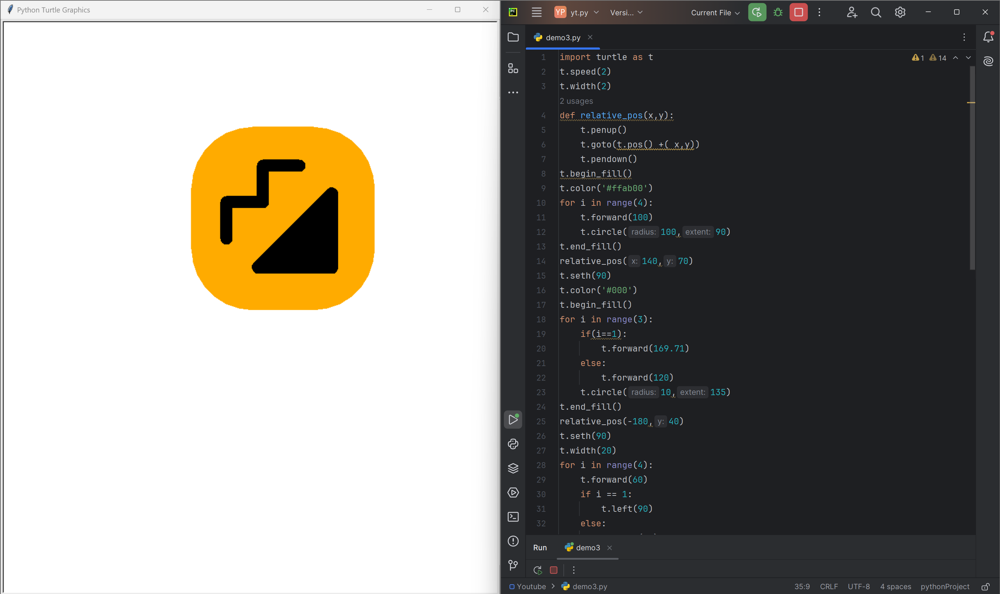

# Moj app logo

This repository contains a Python script that uses the Turtle Graphics module to draw the iconic Python logo. The script creates a visually appealing representation of the Python logo, making use of shapes and colors to closely resemble the original design. Perfect for coding enthusiasts, learners, and those looking to explore Turtle Graphics in Python.

# Tutorial is available on youtube channel 
click on the link to see :- ([Open in Youtube]())

# Screenshot

MOj logo

# Features
Detailed Drawing: The script draws the Python logo with attention to detail, capturing the essential shapes and colors.
Easy to Follow: The code is well-commented and structured for easy understanding and replication.
ASMR Friendly: Ideal for ASMR programming enthusiasts who enjoy relaxing and watching code being executed without any talking.

# Run
To run this code, save it to a file with a .py extension (e.g., demo3.py) and execute it using Python (e.g., demo3.py). This will launch a window displaying the moj logo.

# License
This code is licensed under the MIT License. Feel free to modify, distribute, and use it for any purpose.

# snake.coding
We create a project each 4 days with voting on our <a href="https://youtube.com/@snakecoding_12" target="_blank">Youtube</a> channel.
You can vote for upcoming projects on our channel **community** page :wink:

